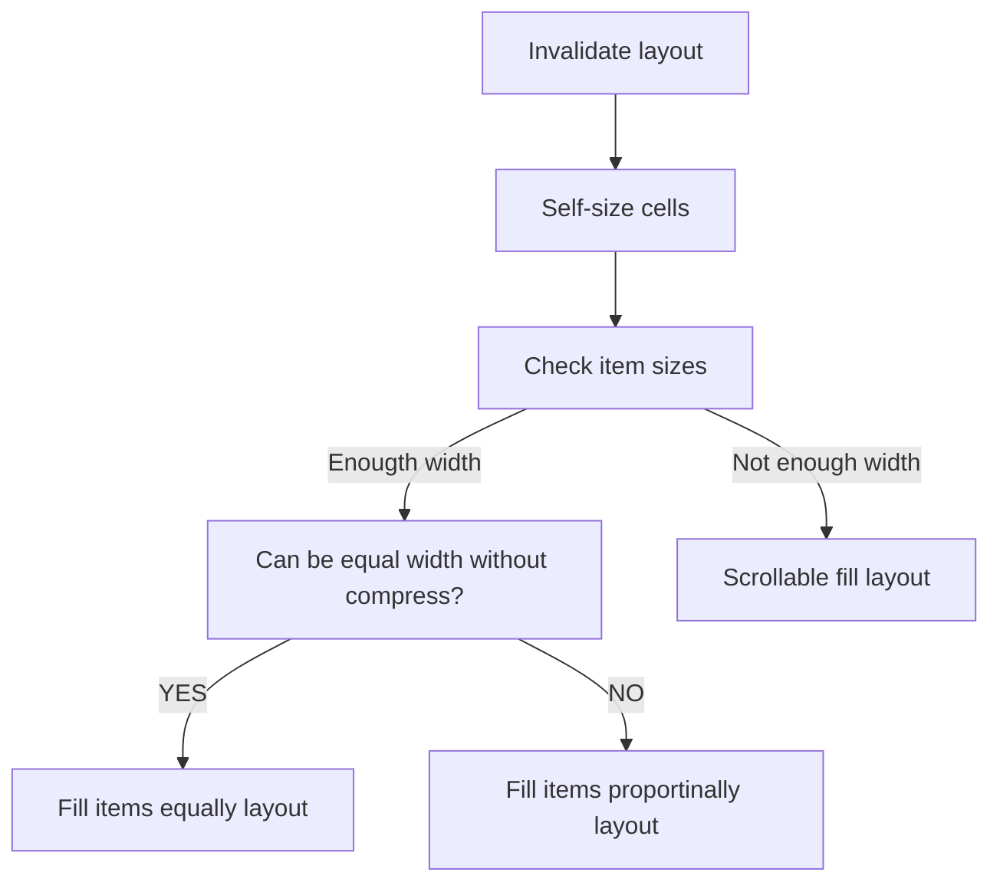

# CollectionViewDistributionalLayout

A UICollectionViewLayout subclass to distribute cells in a collection view with a distribution algorithm.


## Anatomy



## Usage

```swift
let layout = CollectionViewDistributionalLayout()
collectionView.collectionViewLayout = layout
```

## Installation

```swift
.dependencies: [
    .package(
        url: "https://github.com/noppefoxwolf/CollectionViewDistributionalLayout.git", 
        from: "0.0.x"
    )
]
```

## License

CollectionViewDistributionalLayout is available under the MIT license. See the LICENSE file for more info.
